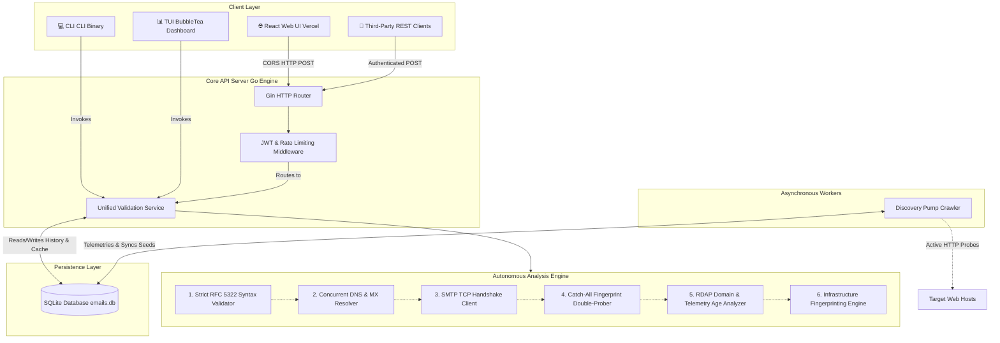
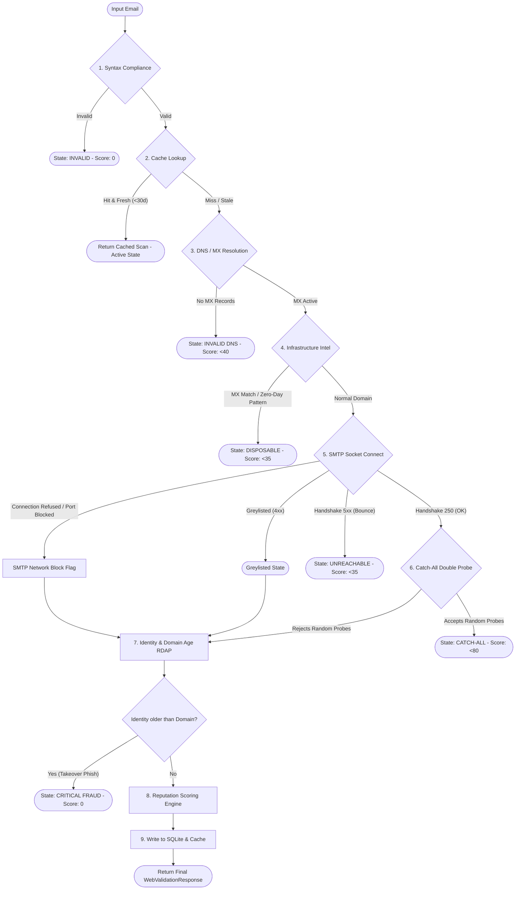

# 🛡️ Enterprise Email Intelligence Platform

A high-performance, production-grade, 100% independent email verification and threat intelligence engine engineered in Go. Operating with **zero third-party validation APIs**, this platform executes real-time DNS/MX resolutions, custom SMTP state-machine handshakes, autonomous infrastructure fingerprinting, and zero-day name heuristics to detect disposable emails and high-stakes fraud.

This enterprise platform features multiple interfaces: a developer-friendly REST API, an advanced Command Line Interface (CLI), a premium terminal-based Interactive dashboard (TUI), and a gorgeous responsive Web UI designed for seamless browser-based verification.

---

## 📐 System Architecture

The following diagram illustrates the decoupled platform architecture, illustrating how multiple client interfaces communicate with the unified Service Layer, backed by a SQLite persistence engine and coordinate with background worker threads.



---

## 📡 The Deep Validation Pipeline

Each email address analyzed by the platform undergoes a rigorous multi-signal analysis. The workflow is designed for maximum throughput, low latencies, and high accuracy:



---

## 🛠️ Complete Tech Stack

### Backend Engine (Go / Systems-Level)
*   **Go (v1.25)**: Core high-performance compiled language using standard library network interfaces.
*   **Gin Gonic**: High-performance HTTP web framework utilized for API routing.
*   **Bubble Tea & Lipgloss (Charmbracelet)**: Terminal User Interface components for rich console interactions.
*   **go-sqlite3**: Database-level CGO wrapper for SQLite local storage persistence.
*   **golang.org/x/time/rate**: Standard Token-Bucket implementation for IP-based API rate limiting.

### Frontend Client (React SPA)
*   **React (v19)**: User interface building blocks.
*   **Vite**: Next-generation frontend bundler for high-speed local dev and optimized production builds.
*   **Vanilla CSS**: Premium bespoke responsive styles with custom parameters, glassmorphism, and hardware-accelerated animations.

### Database Schema
*   **`scans`**: Tracks entire historical validations, raw SMTP server logs, client auditing (IP, User Agent), and execution metrics.
*   **`disposable_domains`**: Autonomous dynamic repository of blocked disposable services.
*   **`disposable_mx_signatures`**: Fingerprints of disposable mail server hubs (e.g. `mail.mailinator.com`).

---

## 🚀 Key Architectural Features

### 1. Autonomous Intelligence & Discovery Pump
Rather than relying on static, quickly outdated text files of throwaway email domains, this platform employs a self-learning loop:
*   **MX Hub Fingerprinting**: Identifies disposable email networks by their root mail server records (MX hosts). If a rotating domain resolves to a Mailinator or EmailOnDeck server hub, it is flagged as disposable instantly.
*   **Zero-Day Name Heuristics**: Custom regex pattern matching detects brand-new burner names (`tempmail-xyz.com`) before active records are even indexed.
*   **Recursive Subdomain Reputation**: Reputational scores cascade down from parents (`test.sub.mailinator.com` matches `mailinator.com`).
*   **Background Crawler**: A telemetry-aware worker proactively crawls external seed sources and live validation traffic, using high-speed parallel workers (`goroutines`) to probe domains and save new disposable patterns to SQLite.

### 2. High-Fidelity SMTP Handshake
*   Custom socket connection timeouts prevent hanging threads.
*   **Greylisting Detection**: Captures transient `4xx` SMTP responses, returning a clean status without incorrectly flagging accounts as permanent failures.
*   **Soft-Bounce Quota Filter**: Detects `5.2.2 Mailbox Full` over-quota errors, keeping the identity marked as valid but flagging the mail system status.

### 3. Identity and Domain Age Verification
*   Utilizes background RDAP (Registration Data Access Protocol) checks to fetch domain age.
*   **Conflict Prevention Alert**: Flags phishing or domain hijack attempts if a user identity registration date predates the active domain creation timestamp.

---

## 📡 API Reference

### 1. Public Validation Demo (Rate-Limited)
Used directly by the web frontend interface for instant checks.

*   **Endpoint**: `/v1/public-validate`
*   **Method**: `POST`
*   **Header**: `Content-Type: application/json`
*   **Body**:
    ```json
    {
      "email": "hello@github.com"
    }
    ```
*   **Response**:
    ```json
    {
      "email": "hello@github.com",
      "is_valid": true,
      "authenticity_status": "Verified",
      "is_temporary": false,
      "reputation_score": 100,
      "recommendation": "Accept",
      "lifecycle_state": "ACTIVE",
      "engagement": {
        "probability": 75,
        "insight": "High likelihood of reply from an established infrastructure.",
        "factors": [
          "+25: Tier-1 Infrastructure (Google/Microsoft)",
          "+20: Established Legacy Identity (>5 yrs)",
          "+10: Active Handshake (250 OK)"
        ]
      },
      "detailed_info": {
        "dns_active": true,
        "smtp_deliverable": true,
        "smtp_response": "250 2.1.5 OK",
        "provider": "Google Workspace",
        "risk_level": "Low",
        "trust_level": "High",
        "message": "Trusted: Tier-1 Infrastructure (Google)",
        "domain_age_years": 30.6,
        "identity_age_years": 30.6,
        "confidence_score": 80,
        "has_alias": false,
        "base_email": "hello@github.com"
      }
    }
    ```

### 2. User Authentication (JWT)
*   **Endpoint**: `/v1/auth/login`
*   **Method**: `POST`
*   **Body**: `{"username": "admin", "password": "your-password"}`
*   **Response**: Returns `access_token` and `refresh_token`.

### 3. Fully Authenticated Validation
*   **Endpoint**: `/v1/validate`
*   **Method**: `POST`
*   **Headers**: `Authorization: Bearer <access_token>`

---

## 📦 Local Installation & Setup

### Requirements
*   Go 1.25+ installed
*   GCC compiler (for compiling the `go-sqlite3` native dependency)

### Build the binaries
```bash
# Clone the repository
git clone https://github.com/<your-username>/email-validator-platform.git
cd email-validator-platform

# Download dependencies
go mod download

# Build backend executables
go build -o email-validator ./cmd/cli/main.go
go build -o email-api ./cmd/api/main.go
```

### Run Client Modes
```bash
# 1. Single Command-Line Email Check
./email-validator check test@gmail.com

# 2. Interactive Terminal BubbleTea Dashboard (TUI)
./email-validator interactive

# 3. Synchronize Discovery Pump Telemetry
./email-validator sync

# 4. Spin up the API Web Server
./email-api
```

---

## ⚡ Deployment & Hosting

### 1. Backend Server Deployment (Docker)
The engine is containerized with custom Alpine environments compiling native C SQLite drivers.

```bash
# Build the Docker container
docker build -t email-validator-api .

# Run container (Binding port 8080)
docker run -d -p 8080:8080 \
  -e JWT_SECRET="your-secure-jwt-key" \
  -e SMTP_SENDER="your-email@example.com" \
  --name email-validator-service \
  email-validator-api
```

### 2. Frontend Vercel Deployment
Deploy the React web UI to Vercel instantly:
1.  Navigate into the `frontend` folder.
2.  Install Vercel CLI: `npm install -g vercel`.
3.  Deploy: run `vercel` inside the frontend directory, link to your Vercel account, and specify the production environment backend API URL in `.env.production` as `VITE_API_URL`.

---

🛡️ Developed with precision by **Sanjana Mahajan** for high-stakes identity verification and system engineering portfolios.
